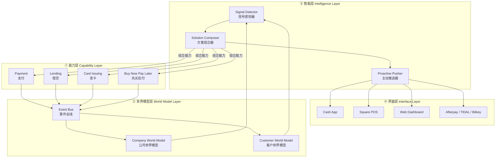

# BlockIntel — 智能商业平台架构设计

> "把公司建成一种智能，用 AI 替代层级管理"
> 灵感来源：Block (前身 Square) 的组织重构实验

## 1. 项目概述

BlockIntel 是一个模拟 Block 公司"用 AI 替代层级管理"理念的智能商业平台。它将传统企业中分散在人脑中的情报，转化为存储在系统中的智能，让人在边缘行动、自主决策。

**核心命题**：层级管理的本质是信息路由。两千年来从未有替代方案——AI 是第一个。

**设计原则**：
- 消费行为是世界上最诚实的信号
- 能力原子化，方案自动组合
- 无产品经理介入，智能层直接感知需求并推送方案
- 扁平组织：IC / DRI / Player Coach，无中间管理层

## 2. 系统架构



### 数据流说明

```
交易数据 → 能力层执行 → 事件总线发布 → 世界模型更新
                                            ↓
                                      智能层感知信号
                                            ↓
                                      自动组合能力方案
                                            ↓
                                      主动推送到界面层
```

## 3. 各层详细设计

### 3.1 能力层 (Capability Layer)

**职责**：提供原子化的业务能力，无 UI，仅暴露 SLA 接口。

| 能力 | SLA 响应时间 | 职责 |
|------|-------------|------|
| PaymentCapability | 200ms | 处理支付请求，返回交易结果 |
| LendingCapability | 500ms | 信用评估，生成贷款方案 |
| CardIssuingCapability | 300ms | 虚拟/实体卡发行 |
| BNPLCapability | 250ms | 分期付款方案生成 |

**技术实现**：
- `Capability` 抽象基类定义统一接口
- `CapabilityRegistry` 注册中心支持按名称/标签发现能力
- 每个能力独立部署，通过 SLA 契约保证服务质量

### 3.2 世界模型层 (World Model Layer)

**职责**：替代管理层的信息路由功能，构成公司的"感知系统"。

#### 公司世界模型 (Company World Model)

| 数据来源 | 内容 |
|---------|------|
| 决策记录 | 讨论、设计、计划 |
| 代码与构建 | 进度、阻塞、版本 |
| 资源与绩效 | 分配、成效、优先级 |

**替代的管理职能**：
- `provide_context()` — 上下文供给：每人随时获取全局
- `auto_align()` — 自动对齐：无需状态会议
- `detect_blockers()` — 阻塞识别：自动发现瓶颈

#### 客户世界模型 (Customer World Model)

| 数据来源 | 内容 |
|---------|------|
| Cash App | 消费者行为：消费模式、收入周期、储蓄习惯 |
| Square | 商户经营：营收趋势、库存周转、员工成本 |
| 交易双侧 | 买家+卖家同时可见，完整经济图谱 |

**信号特性**：
- 诚实信号 — 消费行为不会说谎
- 复利积累 — 越用越深越难复制
- 因果预测 — 从描述到预判

#### 事件总线 (Event Bus)

异步发布-订阅模式，连接世界模型与智能层。支持同步/异步 handler。

### 3.3 智能层 (Intelligence Layer)

**职责**：感知客户需求时机 → 自动组合能力 → 主动推送方案。**不需要产品经理介入。**

| 组件 | 职责 |
|------|------|
| SignalDetector | 分析交易信号，识别现金流短缺、增长机会、季节性模式 |
| SolutionComposer | 根据信号类型匹配能力，生成组合方案（含参数和预期效果） |
| ProactivePusher | 评估推送时机（紧急度、营业时间、会话状态），执行多渠道推送 |

**工作流**：
```
客户世界模型发出信号 → SignalDetector 检测
    → 现金流短缺信号 → SolutionComposer 组合 [借贷 + BNPL + 即时到账]
    → 增长机会信号 → SolutionComposer 组合 [发卡 + 支付优惠]
    → ProactivePusher 评估时机 → 推送到 POS / App / 邮件
```

### 3.4 界面层 (Interface Layer)

**职责**：智能层向用户交付组合方案的出口。

- FastAPI REST API（7 个端点）
- HTML Dashboard（深色主题企业级仪表盘）
- 响应式布局，支持 KPI 卡片、信号监控、方案推荐、能力健康状态

## 4. 组织角色映射

Block 的扁平组织模型在系统中的体现：

| 角色 | 定义 | 系统支持 |
|------|------|---------|
| **个人贡献者 (IC)** | 深度专家，构建能力·模型 | 公司世界模型提供全局上下文，无需管理层传达 |
| **直接负责人 (DRI)** | 跨职能负责人，90天全权调配 | 智能层自动对齐信息，阻塞识别替代状态会议 |
| **玩家教练 (Player Coach)** | 既写代码又带人 | 无状态·对齐会议，专注工艺与成长 |

**核心转变**：传统层级中，情报分散在人脑，靠管理层逐级路由。BlockIntel 中，智能存于系统，人在边缘行动。

## 5. 技术栈

| 层级 | 技术选型 |
|------|---------|
| 后端框架 | Python 3.10+ / FastAPI |
| 数据模型 | dataclass / Pydantic |
| 事件驱动 | 自研 EventBus（发布-订阅） |
| 前端 | HTML5 + CSS Grid + Vanilla JS |
| 类型系统 | Python type hints 全覆盖 |
| 架构风格 | 事件驱动 + 分层架构 |

## 6. 项目结构

```
blockintel-simulation/
├── docs/
│   └── architecture.md          # 本文档
├── src/
│   ├── capability_layer/        # ① 能力层
│   │   ├── base.py              # Capability 抽象基类
│   │   ├── capabilities.py      # 4 个具体能力实现
│   │   └── registry.py          # 能力注册中心
│   ├── world_model/             # ② 世界模型层
│   │   ├── data_models.py       # 8 个数据模型 + mock 生成器
│   │   ├── company_model.py     # 公司世界模型
│   │   ├── customer_model.py    # 客户世界模型
│   │   └── event_bus.py         # 异步事件总线
│   ├── intelligence_layer/      # ③ 智能层
│   │   ├── signal_detector.py   # 信号感知器
│   │   ├── solution_composer.py # 方案组合器
│   │   └── proactive_pusher.py  # 主动推送器
│   └── interface_layer/         # ④ 界面层
│       ├── app.py               # FastAPI 应用 (7 API endpoints)
│       ├── models.py            # Pydantic API 模型
│       └── dashboard.html       # 企业级仪表盘
└── tests/                       # 测试目录
```

## 7. 核心洞察

> **"消费行为是世界上最诚实的信号"**
> 人会说谎、无视广告、放弃购物车——但花钱是事实。

这套架构的本质是：**用诚实信号的复利飞轮替代传统产品路线图**。
- 更丰富信号（买家+卖家双侧）→ 更好的模型（因果与预测增强）→ 更多交易（复利式数据积累）→ 循环复利

AI 不只是工具——它是两千年来第一个真正能打破信息路由瓶颈的方案。
